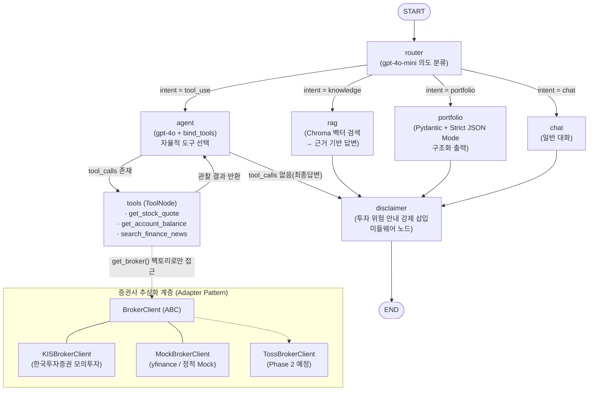

# 📈 오픈 API 기반 국내/해외 주식 통합 투자 가이드 및 포트폴리오 관리 에이전트

LangChain + LangGraph 기반의 자율 투자 가이드 에이전트입니다. 사용자의 자연어 질문 의도를 스스로 분류하여 **실시간 시세/잔고 조회(한국투자증권 Open API)**, **최신 뉴스 검색(Tavily)**, **투자 지식 RAG**, **구조화된 포트폴리오 제안(JSON)** 중 최적의 경로로 자율 실행합니다.

---

## 1. 아키텍처 개요

### 1.1 LangGraph 실행 흐름 (Mermaid)



### 1.2 데이터 흐름

1. **router**: `gpt-4o-mini` + Pydantic 구조화 출력으로 사용자 의도를 `tool_use / knowledge / portfolio / chat` 4종 중 하나로 분류하고 `State.intent`에 기록합니다.
2. **조건부 분기 #1**: `add_conditional_edges("router", route_selector, ...)`가 intent에 따라 4개 노드로 흐름을 분기합니다.
3. **agent ↔ tools (ReAct 루프)**: `gpt-4o`가 질문을 보고 시세·잔고·뉴스 도구를 **자율적으로 선택**합니다. **조건부 분기 #2**(`tools_condition`)가 tool_call 존재 여부로 루프 지속/종료를 결정합니다.
4. **rag**: Chroma 벡터 DB에서 투자 가이드 문서를 검색하여 근거 기반으로만 답변합니다.
5. **portfolio**: OpenAI **Strict JSON Mode**(`method="json_schema", strict=True`)로 `{"종목명", "추천비중", "투자포인트"}` 스키마를 100% 준수하는 JSON을 생성합니다.
6. **disclaimer (미들웨어)**: 모든 종단 경로가 강제 통과하는 노드로, 마지막 AI 메시지에 투자 위험 안내 문구를 삽입합니다.
7. **MemorySaver checkpointer**: `thread_id` 단위로 전체 State를 체크포인팅하여 멀티턴 대화 맥락을 유지합니다.

### 1.3 Phase 1 → Phase 2 전환을 고려한 구조적 설계

| 변경 대상 | 변경 방법 | 상위 코드 영향 |
|---|---|---|
| 증권사 (KIS → 토스증권) | `brokers/toss.py` 구현 후 `factory.py`의 `_REGISTRY`에 **한 줄 등록** + `.env`의 `BROKER_PROVIDER=toss` | **없음** — `@tool`·노드·프롬프트는 `BrokerClient` 인터페이스에만 의존 |
| LLM (gpt-4o → Claude 3.5 Sonnet) | `graph/nodes.py`의 `ChatOpenAI` → `ChatAnthropic` (또는 `init_chat_model`) 교체 | **최소** — `bind_tools`/`with_structured_output` 등 LangChain 표준 인터페이스만 사용 |
| 개발 중 API 키 미발급 | `.env`의 `BROKER_PROVIDER=mock` | **없음** — yfinance/정적 Mock 어댑터가 동일 DTO 반환 |

---

## 2. 프로젝트 구조

```
stock-agent/
├── main.py                 # CLI 엔트리포인트 (멀티턴 데모)
├── config.py               # .env 로드 및 전역 설정
├── state.py                # LangGraph AgentState 정의
├── schemas.py              # Pydantic 구조화 출력 스키마
├── brokers/                # 🔑 증권사 추상화 계층 (Adapter Pattern)
│   ├── base.py             #   BrokerClient(ABC) + Quote/Position DTO
│   ├── kis.py              #   한국투자증권 모의투자 어댑터
│   ├── mock.py             #   yfinance/정적 Mock 어댑터 (디버깅용)
│   └── factory.py          #   BROKER_PROVIDER 기반 팩토리 (교체 지점)
├── tools/
│   ├── stock_tools.py      # Tool 1: 시세/잔고 조회 (@tool)
│   └── news_tools.py       # Tool 2: Tavily 뉴스 검색 (@tool)
├── rag/
│   └── pipeline.py         # PDF 로드 → 분할 → Chroma 인덱싱 → retriever
├── graph/
│   ├── router.py           # 의도 분류 + 조건부 분기 selector
│   ├── nodes.py            # agent / rag / portfolio / chat 노드
│   └── builder.py          # StateGraph 배선 + MemorySaver
└── middleware/
    └── guards.py           # 에러 핸들링 데코레이터 + Disclaimer 노드
```

---

## 3. 설치 및 실행

```bash
# 1) 의존성 설치
pip install -r requirements.txt

# 2) 환경 변수 설정
cp .env.example .env
#   → OPENAI_API_KEY, TAVILY_API_KEY 입력
#   → KIS 키 발급 전이면 BROKER_PROVIDER=mock 유지

# 3) (선택) RAG 문서 배치
#   금융감독원/한국거래소 투자 가이드북 PDF를 data/financial_guide.pdf 로 저장
#   없으면 내장 투자 용어 사전으로 자동 폴백

# 4) 실행
python main.py
```

### 시나리오 예시

| 입력 | 경로 |
|---|---|
| "삼성전자 지금 얼마야?" | router → agent → tools(get_stock_quote) → agent → disclaimer |
| "테슬라 관련 최근 뉴스 요약해줘" | router → agent → tools(search_finance_news) → agent → disclaimer |
| "PER이 뭐야? PBR이랑 뭐가 달라?" | router → rag → disclaimer |
| "내 계좌 기준으로 리밸런싱 추천해줘" | router → portfolio(구조화 JSON) → disclaimer |

---

## 4. 과제 요구사항 매핑

| 요구사항 | 구현 위치 |
|---|---|
| 자율적 도구 선택 (Tool ≥ 2) | `tools/stock_tools.py`(시세·잔고), `tools/news_tools.py`(뉴스) + `graph/nodes.py`의 `bind_tools` |
| RAG 파이프라인 ≥ 1 | `rag/pipeline.py` (PDF → RecursiveCharacterTextSplitter → Chroma → retriever) |
| 대화 이력 유지 (Memory) | `graph/builder.py`의 `MemorySaver` checkpointer + `thread_id` |
| StateGraph + 조건부 분기 ≥ 1 | `builder.py`에 조건부 엣지 **2개** (intent 라우팅, tools_condition) |
| Disclaimer 미들웨어 | `middleware/guards.py`의 `disclaimer_node` (모든 종단 경로 강제 통과) |
| API 에러 핸들링 미들웨어 | `broker_tool_guard` 데코레이터(1차) + `ToolNode(handle_tool_errors=True)`(2차) |
| 구조화된 출력 (Pydantic) | `schemas.py` + `portfolio_node`의 Strict JSON Mode |
| API Key 분리 관리 | `config.py` + `.env` (`.env.example` 제공) |

---

## 5. 한계점 및 향후 개선 방향

### 5.1 현재 한계점 (Phase 1)

- **모의투자 환경 의존**: 한국투자증권 모의투자 API는 일부 TR(해외 잔고 등)의 지원 범위가 실전과 다르고, 토큰 발급 rate limit(분당 1회)이 존재합니다. 토큰 파일 캐싱으로 완화했으나 다중 프로세스 환경에서는 별도 토큰 스토어가 필요합니다.
- **In-Memory Checkpointer**: `MemorySaver`는 프로세스 재시작 시 대화 이력이 소실됩니다. 운영 전환 시 `SqliteSaver`/`PostgresSaver`로 교체가 필요합니다(인터페이스 동일, 한 줄 교체).
- **라우터의 단발 분류**: 복합 의도("시세 보고 리밸런싱까지")는 현재 단일 intent로 축약됩니다. Phase 2에서 멀티스텝 플래너로 확장 예정입니다.
- **RAG 문서 커버리지**: 현재는 단일 가이드북(또는 내장 용어 사전) 기반이라 최신 공시·리포트는 다루지 못합니다.

### 5.2 향후 개선 방향 ① — 토스증권 API 전면 전환 계획

본 프로젝트는 **처음부터 증권사 교체를 전제로 설계**되었습니다. 모든 도구와 노드는 구체 클래스가 아닌 `BrokerClient` 추상 인터페이스(`brokers/base.py`)에만 의존하며(DIP, 의존성 역전 원칙), 증권사별 응답 포맷 차이는 어댑터 내부에서 표준 DTO(`Quote`, `Position`)로 정규화됩니다.

토스증권 API 키 발급 시 전환 절차는 다음 3단계로 완결됩니다.

1. `brokers/toss.py`에 `BrokerClient`를 구현한 `TossBrokerClient` 작성 — 인증 방식과 엔드포인트 차이는 이 파일 안에 완전히 캡슐화됩니다.
2. `brokers/factory.py`의 `_REGISTRY`에 `"toss": TossBrokerClient` **한 줄 등록**.
3. `.env`에서 `BROKER_PROVIDER=toss`로 변경.

이 과정에서 LangGraph 노드, `@tool` 시그니처, 프롬프트, 테스트 코드는 **단 한 줄도 수정되지 않습니다**. 실제로 이 구조는 Phase 1 개발 중 이미 검증되었습니다 — KIS 키 발급 대기 기간 동안 `MockBrokerClient`(yfinance)로 전체 그래프를 개발/디버깅한 뒤, 환경 변수 변경만으로 KIS 어댑터로 전환했기 때문입니다. 즉 Mock ↔ KIS 전환이 곧 KIS ↔ Toss 전환의 리허설입니다.

### 5.3 향후 개선 방향 ② — Phase 2: Claude 3.5 Sonnet 기반 자율 에이전트 고도화

- **LLM 교체 비용 최소화 설계**: 모든 LLM 호출이 LangChain 표준 인터페이스(`bind_tools`, `with_structured_output`, `invoke`)로만 이루어지므로, `ChatOpenAI` → `ChatAnthropic` 교체(또는 `init_chat_model("anthropic:claude-3-5-sonnet")` 도입)만으로 마이그레이션됩니다. OpenAI 전용 기능인 Strict JSON Mode 구간은 Anthropic tool-use 기반 구조화 출력으로 대체하되, Pydantic 스키마는 그대로 재사용합니다.
- **고차원 자율 의사결정**: 계좌 잔고 확인 → 뉴스 트렌드 종합 분석 → 리스크 관리 규칙(예: 단일 종목 30% 상한, 손실률 임계치) 기반 자산 재배분 제안까지 이어지는 멀티스텝 플래닝 루프를 LangGraph 서브그래프로 추가할 계획입니다.
- **Human-in-the-Loop 안전장치**: 실제 주문(매수/매도) 도구를 도입하는 시점에는 LangGraph의 `interrupt` 기능으로 주문 실행 직전 사용자 승인을 강제하여, 자율성과 안전성을 동시에 확보합니다.
- **운영 관측성**: LangSmith 트레이싱을 연동해 도구 선택 정확도, 라우팅 오분류율, API 실패율을 정량 측정하고 라우터 프롬프트를 반복 개선합니다.

---

## ⚠️ Disclaimer

본 프로젝트는 학습/과제 목적이며, 생성되는 모든 답변은 투자 권유가 아닙니다. 모든 투자 판단과 그 결과에 대한 책임은 투자자 본인에게 있습니다.
