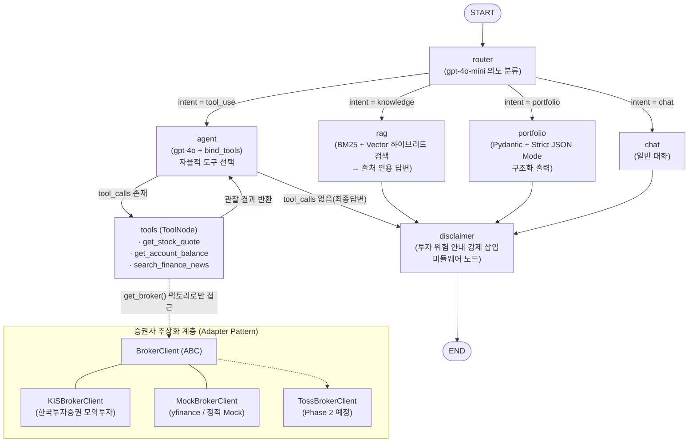

# 📈 오픈 API 기반 국내/해외 주식 통합 투자 가이드 및 포트폴리오 관리 에이전트

LangChain + LangGraph 기반의 자율 투자 가이드 에이전트(챗봇)입니다. 사용자의 자연어 질문 의도를 스스로 분류하여 **실시간 시세/잔고 조회(한국투자증권 Open API)**, **최신 뉴스 검색(Tavily)**, **투자 지식 RAG(FinShibainu 데이터셋)**, **구조화된 포트폴리오 제안(JSON)** 중 최적의 경로로 자율 실행합니다.

---

## 1. 아키텍처 개요

### 1.1 LangGraph 실행 흐름 (Mermaid)



### 1.2 데이터 흐름

1. **router**: `gpt-4o-mini` + Pydantic 구조화 출력으로 사용자 의도를 `tool_use / knowledge / portfolio / chat` 4종 중 하나로 분류하고 `State.intent`에 기록합니다. 이 노드는 매 턴 시작 시 `structured_output`과 `tool_error` 필드를 `None`으로 초기화하여 이전 턴의 부산물이 다음 답변에 누출되지 않도록 합니다.
2. **조건부 분기 #1**: `add_conditional_edges("router", route_selector, ...)`가 intent에 따라 4개 노드로 흐름을 분기합니다.
3. **agent ↔ tools (ReAct 루프)**: `gpt-4o`가 질문을 보고 시세·잔고·뉴스 도구를 **자율적으로 선택**합니다. **조건부 분기 #2**(`tools_condition`)가 tool_call 존재 여부로 루프 지속/종료를 결정합니다.
4. **rag**: BM25(키워드) + Vector(의미) **하이브리드 검색**으로 관련 QA 문서를 검색하고, 검색된 문서의 `row_id`를 답변에 인용(citation)하여 **환각 검증이 가능한 근거 기반 답변**을 생성합니다.
5. **portfolio**: OpenAI **Strict JSON Mode**(`method="json_schema", strict=True`)로 `{"종목명", "추천비중", "투자포인트"}` 스키마를 100% 준수하는 JSON을 생성합니다.
6. **disclaimer (미들웨어)**: 모든 종단 경로가 강제 통과하는 노드로, 마지막 AI 메시지에 투자 위험 안내 문구를 삽입합니다.
7. **MemorySaver checkpointer**: `thread_id` 단위로 전체 State를 체크포인팅하여 멀티턴 대화 맥락을 유지합니다.

### 1.3 RAG 파이프라인 상세

지식 베이스로는 **KRX(한국거래소) LLM 경진대회 수상작인 [aiqwe/FinShibainu](https://huggingface.co/datasets/aiqwe/FinShibainu) 데이터셋의 `qa` subset**을 활용합니다. 이 데이터셋은 한국은행 『경제금융용어 700선』, 시사경제용어사전 등 국내 공식 금융 자료를 원문(reference)으로 삼아 구축된 QA 선호도 데이터셋으로, `preference` 컬럼이 지정하는 우수 답변을 지식 문서로 채택합니다.

- **원본 PDF 대비 이점**: 임베디드 폰트 서브셋 문제로 PyPDF/PyMuPDF/OCR 모두 한글 추출에 실패하는 원본 자료 대신, 이미 정제된 검증 데이터셋을 사용하여 **재현성**과 **답변 신뢰성**을 동시에 확보합니다.
- **하이브리드 검색**: 금융 용어는 정확한 키워드 매칭이 의미 유사도보다 유용한 경우가 많으므로, LangChain `EnsembleRetriever`로 BM25(가중치 0.5)와 Chroma 벡터 검색(가중치 0.5)을 결합합니다. `PER`, `DSR`, `DTA` 같은 영어 약어는 BM25가, 자연어 개념 질문은 벡터 검색이 강점을 발휘합니다.
- **인용(Citation) 강제**: `rag_node`는 검색된 각 문서에 `[자료 N]` 태그를 부여하여 프롬프트에 전달하고, LLM이 답변 내 근거 문장마다 이를 참조하고 말미에 `📚 출처: 한국은행 경제금융용어 700선 (row_id: X)` 형식을 명시하도록 지시합니다.
- **개발 디버깅**: `rag_node`는 검색 결과의 `source`, `row_id`, 내용 프리뷰를 콘솔에 출력하여 RAG 동작을 육안으로 검증할 수 있습니다.

### 1.4 Phase 1 → Phase 2 전환을 고려한 구조적 설계

| 변경 대상 | 변경 방법 | 상위 코드 영향 |
|---|---|---|
| 증권사 (KIS → 토스증권) | `brokers/toss.py` 구현 후 `factory.py`의 `_REGISTRY`에 **한 줄 등록** + `.env`의 `BROKER_PROVIDER=toss` | **없음** — `@tool`·노드·프롬프트는 `BrokerClient` 인터페이스에만 의존 |
| LLM (gpt-4o → Claude 3.5 Sonnet) | `graph/nodes.py`의 `ChatOpenAI` → `ChatAnthropic` (또는 `init_chat_model`) 교체 | **최소** — `bind_tools`/`with_structured_output` 등 LangChain 표준 인터페이스만 사용 |
| 개발 중 API 키 미발급 | `.env`의 `BROKER_PROVIDER=mock`(kis 키 미발급 시 대체용 -> kis키 발급 후 mock 대신 kis로 변경) | **없음** — yfinance/정적 Mock 어댑터가 동일 DTO 반환 |

---

## 2. 프로젝트 구조

```
stock-agent/
├── main.py                 # CLI 엔트리포인트 (개발/디버깅용, 그래프 직접 호출)
├── server.py               # FastAPI 웹 서버 (프론트 서빙 + /api/chat 엔드포인트)
├── config.py               # .env 로드 및 전역 설정
├── state.py                # LangGraph AgentState 정의
├── schemas.py              # Pydantic 구조화 출력 스키마
├── web/                    # 🌐 브라우저 프론트엔드
│   └── index.html          #   심플 채팅 UI (마크다운 렌더링 + 포트폴리오 카드)
├── brokers/                # 🔑 증권사 추상화 계층 (Adapter Pattern)
│   ├── base.py             #   BrokerClient(ABC) + Quote/Position DTO
│   ├── kis.py              #   한국투자증권 모의투자 어댑터
│   ├── mock.py             #   yfinance/정적 Mock 어댑터 (디버깅용)
│   └── factory.py          #   BROKER_PROVIDER 기반 팩토리 (교체 지점)
├── tools/
│   ├── stock_tools.py      # Tool 1: 시세/잔고 조회 (@tool)
│   └── news_tools.py       # Tool 2: Tavily 뉴스 검색 (@tool)
├── rag/
│   └── pipeline.py         # FinShibainu 로드 → BM25+Vector 하이브리드 검색
├── graph/
│   ├── router.py           # 의도 분류 + 조건부 분기 selector + State 초기화
│   ├── nodes.py            # agent / rag / portfolio / chat 노드
│   └── builder.py          # StateGraph 배선 + MemorySaver
└── middleware/
    └── guards.py           # 에러 핸들링 데코레이터 + Disclaimer 노드
```

---

## 3. 설치 및 실행

```bash
# 1) 의존성 설치
pip install -r requirements.txt

# 2) 환경 변수 설정
cp .env.example .env
#   → OPENAI_API_KEY, TAVILY_API_KEY 입력
#   → KIS 키 발급 전이면 BROKER_PROVIDER=mock 유지
```

첫 실행 시 HuggingFace Hub에서 FinShibainu 데이터셋(약 100MB)이 자동 다운로드되어 로컬 캐시(`~/.cache/huggingface/`)에 저장되고, Chroma 벡터 DB(`.chroma/`)가 프로젝트 루트에 생성됩니다. 두 번째 실행부터는 캐시를 재사용하여 즉시 시작됩니다.

### 3.1 웹 UI 실행 (권장)

```bash
python server.py
```

브라우저에서 `http://127.0.0.1:8000` 접속. 첫 화면의 예시 질문 4개를 눌러 그래프의 모든 분기(tool_use / knowledge / portfolio / chat)를 시연할 수 있습니다.

- **마크다운 자동 렌더링**: LLM 답변의 표·굵은글씨·코드블록을 정리해서 표시
- **포트폴리오 카드**: 리밸런싱 응답의 JSON을 종목별 카드 UI로 시각화
- **intent 태그**: 각 답변 상단에 `intent: portfolio` 등으로 라우팅 결과 노출 (그래프 흐름 시연용)
- **thread_id 유지**: localStorage로 저장하여 새로고침 후에도 대화 이력 연속. 우측 상단 "새 대화" 버튼으로 리셋

### 3.2 CLI 실행 (개발/디버깅용)

```bash
python main.py
```

RAG 검색 결과(`[RAG DEBUG]` 로그)와 State 원본을 콘솔에서 직접 확인할 수 있어 파이프라인 디버깅에 편리합니다.

### 시나리오 예시

| 입력 | 경로 |
|---|---|
| "내 주식 잔고 얼마야?" | router → agent → tools(get_account_balance) → agent → disclaimer |
| "삼성전자 지금 얼마야?" | router → agent → tools(get_stock_quote) → agent → disclaimer |
| "테슬라 관련 최근 뉴스 요약해줘" | router → agent → tools(search_finance_news) → agent → disclaimer |
| "DSR과 DTA의 차이가 뭐야?" | router → rag(BM25+Vector 검색 + 출처 인용) → disclaimer |
| "삼성전자 20%, SK하이닉스 30%로 리밸런싱 추천해줘" | router → portfolio(Strict JSON) → disclaimer |

---

### 환경 변수 상세 안내

`.env` 파일의 각 항목을 다음 안내에 따라 입력합니다.

#### API 키 발급

| 변수 | 발급처 | 비고 |
|---|---|---|
| `OPENAI_API_KEY` | [platform.openai.com](https://platform.openai.com) | sk-로 시작 |
| `TAVILY_API_KEY` | [app.tavily.com](https://app.tavily.com) | tvly-로 시작 |
| `KIS_APP_KEY` / `KIS_APP_SECRET` | [한국투자증권 Open API](https://apiportal.koreainvestment.com) | Open API 신청 후 발급 |

#### 한국투자증권 계좌번호 입력 방법

> ⚠️ **반드시 모의투자 계좌번호**를 입력해야 합니다. 실계좌 번호를 입력하면 TR 불일치로 API 오류가 발생합니다.

**모의투자 계좌 개설 방법:**
1. 한국투자증권 앱(MTS) 또는 HTS 접속
2. 메뉴 → **모의투자** → 모의투자 계좌 개설 (즉시 발급, 가상 1,000만원 지급)
3. 발급된 모의투자 계좌번호 확인

**계좌번호 분리 방법:**

모의투자 계좌번호는 `12345678-01` 형태로 발급됩니다. 이를 앞/뒤로 나누어 입력합니다.

```
모의투자 계좌번호: 12345678-01
                  ↑ 앞 8자리    ↑ 뒤 2자리
```

```dotenv
KIS_ACCOUNT_NO=12345678    # 앞 8자리 (하이픈 제외)
KIS_ACCOUNT_PRDT=01        # 뒤 2자리 (보통 01)
```

#### 실계좌 vs 모의투자 차이

| | 모의투자 (현재 설정) | 실계좌 |
|---|---|---|
| **도메인** | `openapivts.koreainvestment.com:29443` | `openapi.koreainvestment.com:9443` |
| **계좌번호** | 모의투자 전용 번호 | 실제 증권 계좌번호 |
| **자금** | 가상 머니 | 실제 자금 ⚠️ |

본 프로젝트는 모의투자 환경 고정으로 설정되어 있어 실제 자금 손실이 발생하지 않습니다.
---

## 4. 과제 요구사항 매핑

| 요구사항 | 구현 위치 |
|---|---|
| 자율적 도구 선택 (Tool ≥ 2) | `tools/stock_tools.py`(시세·잔고), `tools/news_tools.py`(뉴스) + `graph/nodes.py`의 `bind_tools` |
| RAG 파이프라인 ≥ 1 | `rag/pipeline.py` (FinShibainu 데이터셋 → BM25 + Chroma Vector 하이브리드 검색 → 인용 기반 답변) |
| 대화 이력 유지 (Memory) | `graph/builder.py`의 `MemorySaver` checkpointer + `thread_id` |
| StateGraph + 조건부 분기 ≥ 1 | `builder.py`에 조건부 엣지 **2개** (intent 라우팅, tools_condition) |
| Disclaimer 미들웨어 | `middleware/guards.py`의 `disclaimer_node` (모든 종단 경로 강제 통과) |
| API 에러 핸들링 미들웨어 | `broker_tool_guard` 데코레이터(1차) + `ToolNode(handle_tool_errors=True)`(2차) |
| 구조화된 출력 (Pydantic) | `schemas.py` + `portfolio_node`의 Strict JSON Mode |
| API Key 분리 관리 | `config.py` + `.env` (`.env.example` 제공) |

### 4.1 핵심 구성요소 상세 설명

#### 🔧 Tool (자율적 도구 선택)

에이전트는 `gpt-4o`의 `bind_tools`를 통해 아래 3개 도구를 자율적으로 선택하여 호출합니다.
LLM이 사용자 질문을 보고 어떤 도구가 필요한지 스스로 판단하며, 도구 결과를 받아
다시 사고한 뒤 최종 답변을 생성하는 **ReAct(Reasoning + Acting) 루프**로 동작합니다.

| 도구 | 파일 | 설명 |
|---|---|---|
| `get_stock_quote` | `tools/stock_tools.py` | 국내(6자리 종목코드)/해외(티커) 실시간 현재가·등락률 조회. `market="KR"/"US"` 파라미터로 분기 |
| `get_account_balance` | `tools/stock_tools.py` | 증권 계좌 보유종목·수량·평단가·평가손익률 조회 |
| `search_finance_news` | `tools/news_tools.py` | Tavily Search API로 특정 종목·시장·경제 이슈의 최신 뉴스 검색 |

모든 도구에는 `@broker_tool_guard` 데코레이터(에러 핸들링 미들웨어)가 적용되어,
API 호출 실패 시 예외가 그래프 전체를 죽이지 않고 구조화된 오류 문자열로 반환됩니다.

또한 모든 증권사 연동 도구는 `BrokerClient` 추상 인터페이스를 통해서만 증권사에 접근하므로,
한국투자증권 → 토스증권 전환 시 도구 코드는 단 한 줄도 수정되지 않습니다.

---

#### 📚 RAG (Retrieval-Augmented Generation)

사용자가 투자 용어나 금융 지식을 질문하면 `rag_node`가 실행됩니다.

**지식 베이스 구축 과정:**
1. HuggingFace `aiqwe/FinShibainu` 데이터셋(Apache-2.0)의 `qa` subset 로드
2. `reference` 컬럼으로 한국은행 경제금융용어 700선 자료만 필터링 (979개 QA 문서)
3. `preference` 컬럼이 지정한 우수 답변(`answer_B`)을 지식 문서로 채택
4. OpenAI `text-embedding-3-small`로 임베딩 → Chroma 벡터 DB에 인덱싱

**하이브리드 검색:**
단순 벡터 검색만으로는 "PER", "DSR" 같은 영어 약어 매칭이 약하므로,
`EnsembleRetriever`로 **BM25(키워드 매칭, 가중치 0.5) + Vector(의미 검색, 가중치 0.5)**
를 결합한 하이브리드 검색을 구현했습니다.

**인용(Citation) 시스템:**
검색된 문서는 `[자료 N] (row_id=X)` 형식으로 프롬프트에 전달되며,
LLM은 답변 내 근거 문장마다 `[자료 N]`을 인용하고 말미에
`📚 출처: 한국은행 경제금융용어 700선 (row_id: X)`를 명시하도록 강제됩니다.
이를 통해 **LLM이 자체 지식으로 답했는지, RAG 문서를 근거로 답했는지 검증**할 수 있습니다.

---

#### 🧠 Memory (대화 이력 유지)

LangGraph의 `MemorySaver`를 `checkpointer`로 등록하여 `thread_id` 단위로
전체 `AgentState`를 체크포인팅합니다.

```python
# graph/builder.py
app = builder.compile(checkpointer=MemorySaver())

# 호출 시 thread_id로 세션 구분
config = {"configurable": {"thread_id": "user-abc123"}}
result = app.invoke({"messages": [("user", query)]}, config)
```

- **멀티턴 유지**: 같은 `thread_id`로 호출하면 이전 대화 맥락이 그대로 이어짐
- **세션 분리**: 다른 `thread_id`는 완전히 독립된 대화 세션
- **State 구조**: `AgentState`의 `messages` 필드는 `add_messages` 리듀서를 사용하여
  노드가 새 메시지를 반환하면 기존 이력에 append, 같은 id면 replace 처리
- **웹 UI 연동**: `thread_id`를 브라우저 localStorage에 저장하여 새로고침 후에도 이력 유지.
  "새 대화" 버튼으로 새 `thread_id`를 발급받아 세션을 초기화

> **현재 한계**: `MemorySaver`는 인메모리 저장이라 서버 재시작 시 이력이 소실됩니다.
> Phase 2에서 `PostgresSaver`로 교체하면 인터페이스 변경 없이 영속화됩니다(한 줄 교체).

---

#### 🛡️ Middleware (미들웨어)

두 가지 미들웨어가 독립적인 계층으로 구현되어 있습니다.

#### 1) 에러 핸들링 미들웨어 — `@broker_tool_guard`

`middleware/guards.py`의 데코레이터로, 모든 증권사 API 도구에 적용됩니다.

```python
@tool
@broker_tool_guard          # ← 미들웨어: API 예외를 구조화된 문자열로 변환
def get_stock_quote(...):
    ...
```

- `requests.exceptions.Timeout` → `"[API_ERROR] 증권사 API 응답 시간 초과..."`
- `requests.exceptions.RequestException` → `"[API_ERROR] 증권사 API 호출 실패..."`
- 기타 예외 → `"[TOOL_ERROR] {예외 타입}: {메시지}"`

예외가 그래프를 죽이는 대신 오류 문자열로 변환되어 에이전트에게 전달되므로,
에이전트가 상황을 사용자에게 설명하거나 다른 도구로 우회하게 됩니다.
`ToolNode(handle_tool_errors=True)` 설정으로 2차 방어선도 구축되어 있습니다.

#### 2) Disclaimer 미들웨어 — `disclaimer_node`

모든 종단 경로(rag → disclaimer, portfolio → disclaimer, chat → disclaimer,
agent 최종 답변 → disclaimer)가 `END` 직전에 **반드시** 통과하는 노드입니다.

```python
# graph/builder.py — 모든 경로가 disclaimer를 강제 통과
builder.add_edge("rag", "disclaimer")
builder.add_edge("portfolio", "disclaimer")
builder.add_edge("chat", "disclaimer")
builder.add_conditional_edges(
    "agent", tools_condition,
    {"tools": "tools", "__end__": "disclaimer"}  # ← 최종 답변도 disclaimer로
)
builder.add_edge("disclaimer", END)
```

LangGraph `add_messages` 리듀서의 **same-id replace** 특성을 활용하여,
마지막 AI 메시지와 동일한 `id`를 가진 새 메시지를 반환함으로써
기존 메시지를 append 없이 교체하는 방식으로 면책 조항을 삽입합니다.

---

## 5. 개발 과정에서의 주요 엔지니어링 결정

### 5.1 RAG 데이터 소스 전환 (PDF → 검증된 공개 데이터셋)

초기에는 한국은행 『경제금융용어 700선』 PDF를 직접 인덱싱하려 했으나, 해당 PDF가 임베디드 폰트 서브셋과 특수 CMap을 사용하여 표준 텍스트 추출 도구(PyPDF, PyMuPDF)로는 한글 추출이 불가능했습니다. OCR(RapidOCR) 폴백을 구현하여 이미지→텍스트 변환을 시도했으나, OCR 결과에서 영어와 페이지 구조는 유지되는 반면 한글이 중국어/깨진 문자로 오인식되는 문제가 발생했습니다.

이 문제를 LLM 재작성으로 우회하는 것은 **RAG의 근본 원칙인 '검증 가능한 원문 기반 답변'을 훼손**한다고 판단하여, 동일한 원문 계보를 갖는 검증된 공개 데이터셋(FinShibainu)을 지식 베이스로 채택했습니다. 이 결정으로 얻은 이점은 다음과 같습니다.

- **재현성**: PDF/OCR 환경 의존성 제거. `pip install` 만으로 어떤 환경에서든 동일한 지식 베이스 구축 가능
- **품질 검증**: 데이터셋이 DPO(Direct Preference Optimization) 학습용으로 만들어졌기 때문에 `preference`와 `value` 컬럼으로 답변 품질이 이미 라벨링되어 있어, 우수 답변만 선별하여 인덱싱 가능
- **원문 계보 유지**: 데이터셋의 `reference` 컬럼이 원본 자료명을 보존하므로 답변 출처를 사용자에게 그대로 노출 가능

### 5.2 RAG 인용 시스템 도입

RAG가 검색한 문서가 실제로 답변에 사용됐는지, 아니면 LLM이 자체 지식으로 답한 것인지 개발 초기에는 검증할 수 없었습니다. 이를 해결하기 위해 두 층의 검증 레이어를 도입했습니다.

- **개발자 레이어**: `rag_node`가 검색된 각 문서의 `source`, `row_id`, 프리뷰를 콘솔에 출력하여 개발자가 육안 검증
- **사용자 레이어**: LLM 프롬프트에 각 참고 자료를 `[자료 N] (row_id=X)` 형식으로 나열하고, 답변 내 근거 문장마다 `[자료 N]`을 인용하며 말미에 `📚 출처`를 명시하도록 강제

이 방식은 표준 RAG 아키텍처의 **grounding & citation** 원칙을 구현한 것으로, 사용자가 답변의 진위를 원문 대조로 확인할 수 있게 합니다.

### 5.3 State 격리 원칙

라우터 노드가 매 턴 시작 시 `structured_output`, `tool_error`를 `None`으로 초기화하도록 설계했습니다. LangGraph의 State는 명시적으로 덮어쓰지 않으면 이전 턴 값이 유지되는데, 포트폴리오 노드가 남긴 JSON이 이후 뉴스/RAG 답변에도 함께 노출되는 부작용을 개발 중 발견하여 수정한 결과입니다.

---

## 6. 한계점 및 향후 개선 방향

### 6.1 현재 한계점 (Phase 1)

- **모의투자 환경 의존**: 한국투자증권 모의투자 API는 일부 TR(해외 잔고 등)의 지원 범위가 실전과 다르고, 토큰 발급 rate limit(분당 1회)이 존재합니다. 토큰 파일 캐싱으로 완화했으나 다중 프로세스 환경에서는 별도 토큰 스토어가 필요합니다.
- **In-Memory Checkpointer**: `MemorySaver`는 프로세스 재시작 시 대화 이력이 소실됩니다. 운영 전환 시 `SqliteSaver`/`PostgresSaver`로 교체가 필요합니다(인터페이스 동일, 한 줄 교체).
- **라우터의 단발 분류**: 복합 의도("시세 보고 리밸런싱까지")는 현재 단일 intent로 축약됩니다. Phase 2에서 멀티스텝 플래너로 확장 예정입니다.
- **RAG 데이터셋 필터링 비용**: 매 실행 시 전체 44,870행을 순회해 한국은행 자료(약 979개)로 필터링하는 오버헤드가 있습니다. 필터링 결과를 로컬 JSON 캐시로 저장하는 최적화가 가능합니다.
- **RAG 커버리지**: 현재는 한국은행 경제금융용어 700선 카테고리만 활성화되어 있어 시사 이슈나 최신 규제 변화는 다루지 못합니다. `TARGET_REFERENCES`에 다른 소스를 추가하거나, Tavily 뉴스 검색과 RAG를 결합한 하이브리드 답변 전략이 필요합니다.

### 6.2 향후 개선 방향 ① — Phase 2: 토스증권 API 전면 전환 계획

본 프로젝트는 **처음부터 증권사 교체를 전제로 설계**되었습니다. 모든 도구와 노드는 구체 클래스가 아닌 `BrokerClient` 추상 인터페이스(`brokers/base.py`)에만 의존하며(DIP, 의존성 역전 원칙), 증권사별 응답 포맷 차이는 어댑터 내부에서 표준 DTO(`Quote`, `Position`)로 정규화됩니다.

토스증권 API 키 발급 시 전환 절차는 다음 3단계로 완결됩니다.

1. `brokers/toss.py`에 `BrokerClient`를 구현한 `TossBrokerClient` 작성 — OAuth 2.0 Client Credentials Grant 인증과 `X-Tossinvest-Account` 헤더 처리를 이 파일 안에 완전히 캡슐화
2. `brokers/factory.py`의 `_REGISTRY`에 `"toss": TossBrokerClient` **한 줄 등록**
3. `.env`에서 `BROKER_PROVIDER=toss`로 변경

이 과정에서 LangGraph 노드, `@tool` 시그니처, 프롬프트, 테스트 코드는 **단 한 줄도 수정되지 않습니다**. 실제로 이 구조는 Phase 1 개발 중 이미 검증되었습니다 — KIS 키 발급 대기 기간 동안 `MockBrokerClient`(yfinance)로 전체 그래프를 개발/디버깅한 뒤, 환경 변수 변경만으로 KIS 어댑터로 전환했기 때문입니다. 즉 Mock ↔ KIS 전환이 곧 KIS ↔ Toss 전환의 리허설입니다.

### 6.3 향후 개선 방향 ② — Phase 2: Claude 3.5 Sonnet 기반 자율 에이전트 고도화

- **LLM 교체 비용 최소화 설계**: 모든 LLM 호출이 LangChain 표준 인터페이스(`bind_tools`, `with_structured_output`, `invoke`)로만 이루어지므로, `ChatOpenAI` → `ChatAnthropic` 교체(또는 `init_chat_model("anthropic:claude-3-5-sonnet")` 도입)만으로 마이그레이션됩니다. OpenAI 전용 기능인 Strict JSON Mode 구간은 Anthropic tool-use 기반 구조화 출력으로 대체하되, Pydantic 스키마는 그대로 재사용합니다.
- **고차원 자율 의사결정**: 계좌 잔고 확인 → 뉴스 트렌드 종합 분석 → 리스크 관리 규칙(예: 단일 종목 30% 상한, 손실률 임계치) 기반 자산 재배분 제안까지 이어지는 멀티스텝 플래닝 루프를 LangGraph 서브그래프로 추가할 계획입니다.
- **Human-in-the-Loop 안전장치**: 실제 주문(매수/매도) 도구를 도입하는 시점에는 LangGraph의 `interrupt` 기능으로 주문 실행 직전 사용자 승인을 강제하여, 자율성과 안전성을 동시에 확보합니다.
- **운영 관측성**: LangSmith 트레이싱을 연동해 도구 선택 정확도, 라우팅 오분류율, API 실패율, RAG 검색 재현율(Recall@k)을 정량 측정하고 라우터 프롬프트와 하이브리드 검색 가중치를 반복 개선합니다.

---

## 7. 참고 데이터셋 및 라이선스

본 프로젝트의 RAG 지식 베이스는 다음 공개 데이터셋을 활용합니다.

- **Dataset**: [aiqwe/FinShibainu](https://huggingface.co/datasets/aiqwe/FinShibainu)
- **GitHub**: [aiqwe/FinShibainu](https://github.com/aiqwe/FinShibainu)
- **License**: Apache License 2.0
- **Original Sources**: 한국은행 『경제금융용어 700선』, 시사경제용어사전 외

```
@misc{jaylee2024finshibainu,
  author = {Jay Lee},
  title = {FinShibainu: Korean specified finance model},
  year = {2024},
  publisher = {GitHub},
  journal = {GitHub repository},
  url = {https://github.com/aiqwe/FinShibainu}
}
```

---

## ⚠️ Disclaimer

본 프로젝트는 학습/과제 목적이며, 생성되는 모든 답변은 투자 권유가 아닙니다. 모든 투자 판단과 그 결과에 대한 책임은 투자자 본인에게 있습니다.